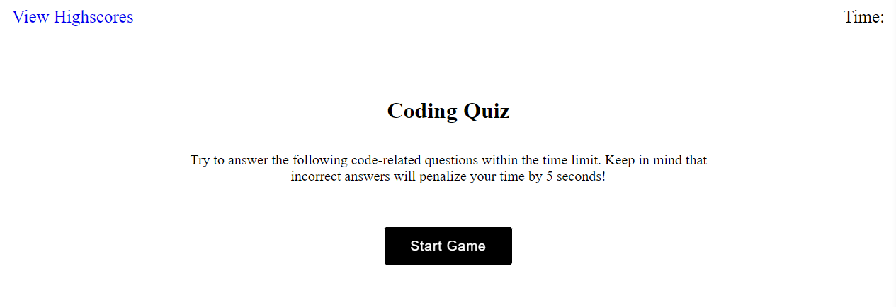

# The Coding Quiz
 
## Description
 
With how many job openings there are within the programming industry, it would be an amazing idea to have a quiz to help new and upcoming programmers test their knowledge.
 
This coding quiz was created to do just that. The quiz has basic coding questions that new and experienced programmers should know. It has a set number of questions and more will be added periodically as the demand increases.
 
## How to Play
 
- The quiz score system is determined by how accurately and fast you answer the questions.
 
- By choosing the correct answer, you will be notified with "Correct" and "Wrong" if you chose wrong.
 
- Each time you answer a question wrong, you will have 5 seconds deducted from your overall time.
 
- If time runs out you lose and have to try again.
 
- If you beat the time, then you can place your initials to keep your high score!

## Website Showcase

### <ins>[The Coding Quiz](https://tiomeko.github.io/the-coding-quiz/)</ins>

